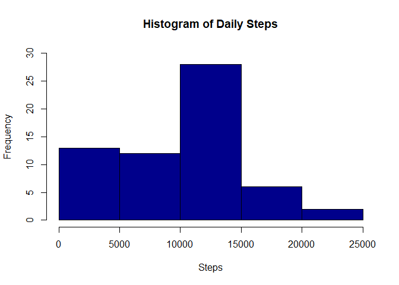
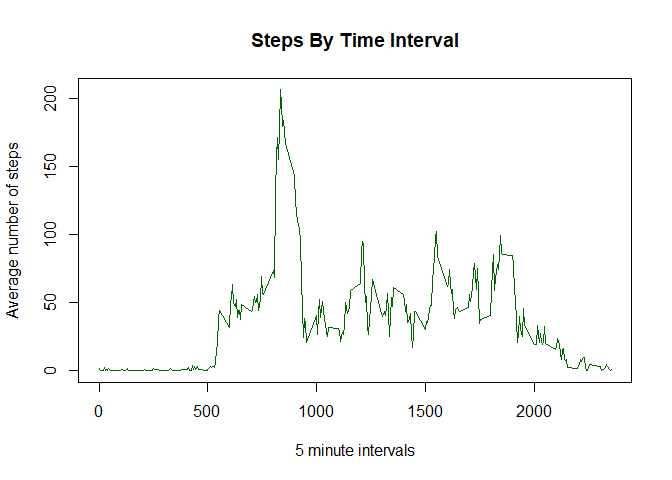
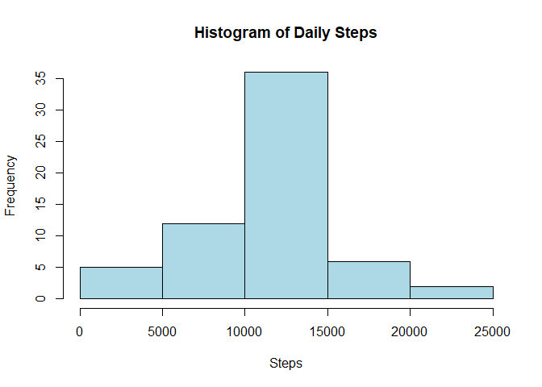
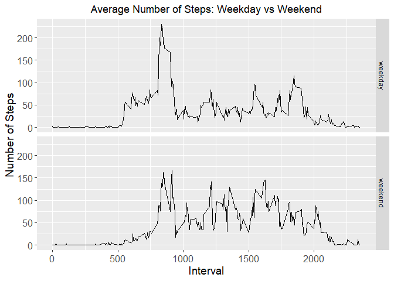

## Packages used

```r
library(ggplot2)
library(dplyr)
```

```
## 
## Attaching package: 'dplyr'
```

```
## The following objects are masked from 'package:stats':
## 
##     filter, lag
```

```
## The following objects are masked from 'package:base':
## 
##     intersect, setdiff, setequal, union
```

## Loading and preprocessing the data
Downloading and unzipping file for processing. Read and load CSV file into a dataframe. 

```r
if(!file.exists("./data")){dir.create("./data")}
fileUrl <- "https://d396qusza40orc.cloudfront.net/repdata%2Fdata%2Factivity.zip"
download.file(fileUrl,destfile = "./data/activity.zip", method = "curl")

unzip(zipfile = "./data/activity.zip",exdir = "./data")
activity <- read.csv("./data/activity.csv")
activity$date <-as.Date(activity$date)
```

## Data Analysis
### Question 1 : What is mean total number of steps taken per day?
  a. Calculating total number of steps per day

```r
stepsperday <- activity %>% group_by(date) %>%
  summarize(sumsteps = sum(steps, na.rm = TRUE))
```
  b.  Make a histogram of the results

```r
hist(stepsperday$sumsteps, main = "Histogram of Daily Steps", 
     col = "darkblue", xlab = "Steps", ylim = c(0,30))
```

<!-- -->
  
  c. Calculate and report the mean and median total number of steps taken per day

```r
meansteps <- round(mean(stepsperday$sumsteps))
mediansteps <- round(median(stepsperday$sumsteps))
print(paste("The mean is", meansteps))
```

```
## [1] "The mean is 9354"
```

```r
print(paste("The median is ", mediansteps))
```

```
## [1] "The median is  10395"
```

### Question 2: What is the average daily activity pattern?
  a.    Make a time series plot of the 5-minute interval (x-axis), and the average number of steps taken, averaged across all days (y-axis)
  

```r
stepsperinterval <- activity %>% group_by(interval) %>%
  summarize(meansteps1 = mean(steps, na.rm = TRUE))

plot(stepsperinterval$meansteps1 ~ stepsperinterval$interval,
     col = "darkgreen", type = "l", xlab = "5 minute intervals",
     ylab = "Average number of steps", main = "Steps By Time Interval")
```

<!-- -->

  b. Which 5-minute interval, on average across all days in the dataset, contains the maximum number of steps?

```r
print(paste("The 5-minute interval containing the most steps on average is",
            stepsperinterval$interval[which.max(stepsperinterval$meansteps1)]))
```

```
## [1] "The 5-minute interval containing the most steps on average is 835"
```

```r
print(paste("Average steps for that interval is", round(max(stepsperinterval$meansteps1))))
```

```
## [1] "Average steps for that interval is 206"
```

### Question 3: Imputing missing values
  a. Calculate and report the total number of missing values in the dataset. 

```r
print(paste("The total number of rows with missing values is",
            sum(is.na(activity$steps))))
```

```
## [1] "The total number of rows with missing values is 2304"
```

  b. Devise a strategy for filling all the missing values in the dataset. 
  
  One of the strategies for filling all the values in the dataset is to input the average of the associated interval. This was already calculated in the previous step, and using a loop all NA values can be identified and then transformed by associating the appropriate interval with the "steps" value in the 'stepsperinterval' data frame created in the previous step.   
  
  c. Create a new dataset that is equal to the previous dataset but with all missing values filled in. 
  

```r
activitynoNA <- activity
for (i in 1:nrow(activity)) {
  if(is.na(activity$steps[i])){
    activitynoNA$steps[i] <- stepsperinterval$meansteps1[activitynoNA$interval[i] == stepsperinterval$interval]
  }
  
}
```

  d. Make a histogram of total number of steps taken each day


```r
stepsperday <- activitynoNA %>%
  group_by(date) %>%
  summarize(sumsteps = sum(steps, na.rm = TRUE))

hist(stepsperday$sumsteps, main = "Histogram of Daily Steps",
     col = "lightblue", xlab = "Steps")
```

<!-- -->

  d. (contd.) Calculate and report the mean and median total number of steps taken each day. Has the value changed from what was initially reported? What is the impact of imputing missing data on the estimates of total number of steps?
  

```r
meanNA <- round(mean(stepsperday$sumsteps), digits = 2)
medianNA <- round(median(stepsperday$sumsteps), digits = 2)

print(paste("The mean is", mean(meanNA)))
```

```
## [1] "The mean is 10766.19"
```

```r
print(paste("The median is", median(medianNA)))
```

```
## [1] "The median is 10766.19"
```


```r
library(xtable)
NAcompare <- data.frame(mean = c(meansteps, meanNA), median = c(mediansteps, medianNA))
rownames(NAcompare) <- c("Pre NA transformation", "Post NA Transformation")
xt <- xtable(NAcompare)
print (xt, type="html")
```

<!-- html table generated in R 4.3.0 by xtable 1.8-4 package -->
<!-- Fri Jun 16 08:12:27 2023 -->
<table border=1>
<tr> <th>  </th> <th> mean </th> <th> median </th>  </tr>
  <tr> <td align="right"> Pre NA transformation </td> <td align="right"> 9354.00 </td> <td align="right"> 10395.00 </td> </tr>
  <tr> <td align="right"> Post NA Transformation </td> <td align="right"> 10766.19 </td> <td align="right"> 10766.19 </td> </tr>
   </table>


As we can see, when the missing values are included we see an increase in the mean and median values from 9354 and 10395 to 10766.19 for both respectively. 

### Question 4: Are there differences in activity patterns between weekdays and weekends?
  a. Create a new factor variable in the dataset with two levels- "weekday" and "weekend" indicating whether a given date is a weekday or a weekend.
  

```r
activityDoW <- activitynoNA
activityDoW$date <- as.Date(activityDoW$date)
activityDoW$day <- ifelse(weekdays(activityDoW$date) %in% c("Saturday", "Sunday"), "weekend", "weekday")
activityDoW$day <- as.factor(activityDoW$day)
```

  b. Make a panel plot containing a time series plot of the 5-minute interval (x-axis) and the average number of steps taken, averaged across all weekday days or weekend days (y-axis)

```r
activityweekday <- filter(activityDoW, activityDoW$day == "weekday")
activityweekend <- filter(activityDoW, activityDoW$day == "weekend")

activityweekday <- activityweekday %>% 
  group_by(interval) %>% 
  summarize(steps = mean(steps))
activityweekday$day <- "weekday"

activityweekend <- activityweekend %>% 
  group_by(interval) %>% 
  summarize(steps = mean(steps))
activityweekend$day <- "weekend"

wkdaywkend <- rbind(activityweekday, activityweekend)
wkdaywkend$day <- as.factor(wkdaywkend$day)

g <- ggplot(wkdaywkend, aes(interval, steps))
g + geom_line()+ facet_grid(day~.)+ 
  theme(axis.text = element_text(size = 12), axis.title = element_text(size = 14)) + labs(y = "Number of Steps")+ labs(x = "Interval")+ ggtitle("Average Number of Steps: Weekday vs Weekend") + theme(plot.title = element_text(hjust = 0.5))
```

<!-- -->

As we can see, there are slight variations in the number of steps taken during the week vs during the weekends. Weekdays show a spike in early morning, possibly coinciding with people walking to work/school or commute. In comparison, step counts on weekends are largely consistent throughout the day.  
