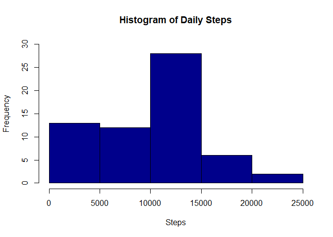

## Packages used

```r
library(ggplot2)
library(dplyr)
```

```
## 
## Attaching package: 'dplyr'
```

```
## The following objects are masked from 'package:stats':
## 
##     filter, lag
```

```
## The following objects are masked from 'package:base':
## 
##     intersect, setdiff, setequal, union
```

## Loading and preprocessing the data
Downloading and unzipping file for processing. Read and load CSV file into a dataframe. 

```r
if(!file.exists("./data")){dir.create("./data")}
fileUrl <- "https://d396qusza40orc.cloudfront.net/repdata%2Fdata%2Factivity.zip"
download.file(fileUrl,destfile = "./data/activity.zip", method = "curl")

unzip(zipfile = "./data/activity.zip",exdir = "./data")
activity <- read.csv("./data/activity.csv")
activity$date <-as.Date(activity$date)
```

## Data Analysis
### Question 1 : What is mean total number of steps taken per day?
  a. Calculating total number of steps per day

```r
stepsperday <- activity %>% group_by(date) %>%
  summarize(sumsteps = sum(steps, na.rm = TRUE))
```
  b.  Make a histogram of the results

```r
hist(stepsperday$sumsteps, main = "Histogram of Daily Steps", 
     col = "darkblue", xlab = "Steps", ylim = c(0,30))
```

<!-- -->
  
  c. Calculate and report the mean and median total number of steps taken per day

```r
meansteps <- round(mean(stepsperday$sumsteps))
mediansteps <- round(median(stepsperday$sumsteps))
print(paste("The mean is", meansteps))
```

[1] "The mean is 9354"

```r
print(paste("The median is ", mediansteps))
```

[1] "The median is  10395"

### Question 2: What is the average daily activity pattern?
  a.    Make a time series plot of the 5-minute interval (x-axis), and the average number of steps taken, averaged across all days (y-axis)
  

```r
stepsperinterval <- activity %>% group_by(interval) %>%
  summarize(meansteps1 = mean(steps, na.rm = TRUE))

plot(stepsperinterval$meansteps1 ~ stepsperinterval$interval,
     col = "darkgreen", type = "l", xlab = "5 minute intervals",
     ylab = "Average number of steps", main = "Steps By Time Interval")
```

<!-- -->
  b. Which 5-minute interval, on average across all days in the dataset, contains the maximum number of steps?

```r
print(paste("The 5-minute interval containing the most steps on average is", stepsperinterval$interval[which.max(stepsperinterval$meansteps1)]))
```

[1] "The 5-minute interval containing the most steps on average is 835"

```r
print(paste("Average steps for that interval is", round(max(stepsperinterval$meansteps1))))
```

[1] "Average steps for that interval is 206"


### Question 3: Inputing missing values


### Question 4: Are there differences in activity patterns between weekdays and weekends?
